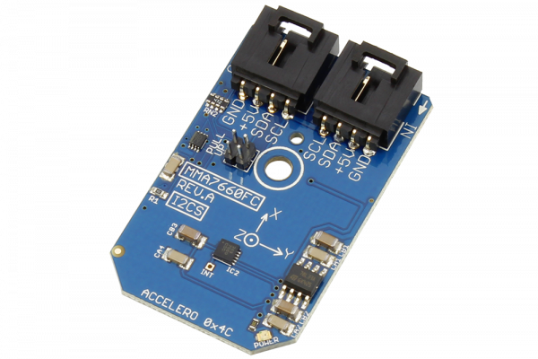

# MMA7660FC

Manufactured by Freescale Semiconductor, Inc., the MMA7660FC 3-Axis Digital Accelerometer is a low power, micro-machined sensor capable of measuring acceleration along its X, Y, and Z axis.
This Device is available from www.ncd.io 

[SKU: MMA7660FC_I2CS]

(https://store.ncd.io/product/mma7660fc-3-axis-orientationmotion-detection-sensor-%C2%B11-5-g-accelerometer-i2c-mini-module/)
This Sample code can be used with Arduino.

Hardware needed to interface MMA7660FC sensor with Arduino

1. <a href="https://store.ncd.io/product/i2c-shield-for-arduino-nano/">Arduino Nano</a>

2. <a href="https://store.ncd.io/product/i2c-shield-for-arduino-micro-with-i2c-expansion-port/">Arduino Micro</a>

3. <a href="https://store.ncd.io/product/i2c-shield-for-arduino-uno/">Arduino uno</a>

4. <a href="https://store.ncd.io/product/dual-i2c-shield-for-arduino-due-with-modular-communications-interface/">Arduino Due</a>

5. <a href="https://store.ncd.io/product/mma7660fc-3-axis-orientationmotion-detection-sensor-%C2%B11-5-g-accelerometer-i2c-mini-module/">MMA7660FC 3Axis motion detection and accelometer sensor</a>

6. <a href="https://store.ncd.io/product/i%C2%B2c-cable/">I2C Cable</a>

MMA7660FC:

Manufactured by Freescale Semiconductor, Inc., the MMA7660FC 3-Axis Digital Accelerometer is a low power, micro-machined sensor capable of measuring acceleration along its X, Y, and Z axis.

Applications:

• Motion sensing,event recorder,vibration monitoring and compensation, etc.

How to Use the MMA7660FC Arduino Library

The MMA7660FC has a number of settings, which can be configured based on user requirements.
          
1.Address calling:The following command is used to call the address of MCP3426 sensor to begin the transmission.

              mma.getAddr_MMA7660FC(MMA7660FC_DEFAULT_ADDRESS_ACCEL);        // 0x4C

2.Sensor setup:The following command is used to measure the output of ADC.

              mma.setUpAccelerometer();
              
3.Output measurement:The following command is used to measure the output of accelometer.

               mma.Measure_Accelerometer();
